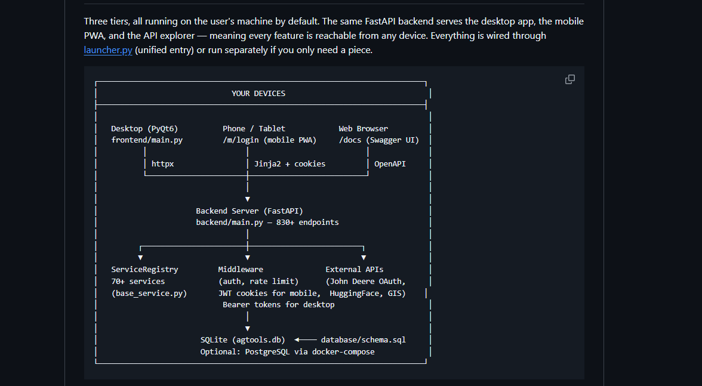

# AgTools — Commercial Agricultural Decision Support Platform

Levee Line Research LLC operates as the federally-funded R&D engine; **AgTools** is the mature commercial product line that deploys validated research into a real consultant-and-grower-facing tool. AgTools is operated under an existing 30-year row-crop farm operation, ships at **v6.17.0** with **1,042 tests**, and is licensed commercially. Source is not open; access is available to qualified parties on request.

---

## What AgTools Is

AgTools is not a single-purpose app. It is a full agricultural decision support platform covering pest and disease identification, spray recommendations, sustainability accounting, climate tracking, field-trial research tools, financial and accounting management, GIS mapping, livestock management, seed and planting management, and direct integrations with John Deere Operations Center (JDOps) and HuggingFace.

It is the kind of platform a Phase III SBIR commercialization plan is supposed to describe. Levee Line will not have to build that platform — it already exists.

---

## Capabilities (Headline Features)

| Capability | What It Does | Research Deployment Slot |
|------------|--------------|--------------------------|
| **Pest & Disease ID** | 46+ species (corn & soybean), hybrid cloud/local AI with HuggingFace integration, image-based + symptom questionnaire, top-5 predictions with confidence scoring, knowledge-base fallback, user-feedback retraining loop | Direct slot for new computer-vision models trained at Levee Line |
| **Spray Recommendations** | 40+ registered pesticide database, automatic MOA rotation tracking, economic threshold triggers, weather-integrated spray windows, REI/PHI compliance | Slot for new decision algorithms and resistance-management models |
| **Sustainability Metrics** | EPA/IPCC-compliant carbon accounting, 14 conservation practices tracked, A–F sustainability grade, year-over-year trend analysis, per-acre CO2e | Climate-Smart Agriculture grant narratives plug directly in |
| **Climate & Weather** | Open-Meteo integration, GDD tracking for 8 crops with crop-specific base temperatures, growth-stage prediction (14 stages for corn, 9 for soy), frost dates, heat-stress monitoring | Climate-adaptation validation infrastructure |
| **Field Trial Tools** | 7 trial types, 5 experimental designs (CRD, RCBD, split-plot, strip-plot, factorial), 11 standard measurement types, statistical analysis (means, t-tests, LSD at 0.05 and 0.01) | Levee Line's own field trials run on the existing platform |
| **Yield Prediction** | Random Forest model, 6 crops (corn, soybean, wheat, rice, cotton, sorghum), cross-validated, agronomic-formula fallback | Pipeline for new yield models trained on multi-modal data |
| **Crop Health Scoring** | NDVI and Excess-Green analysis from UAV imagery, 6 health levels, configurable grid resolution, issue detection (water stress, nutrient deficiency, pest damage) | Deployment for any new imagery-based AI work |
| **GenFin Accounting** | Full double-entry, 50+ professional reports, accounts payable + receivable, banking with check printing (MICR) and NACHA ACH, payroll with 2024 tax brackets, 1099 tracking, multi-entity, budgeting and forecasting, inventory (FIFO/LIFO), classes and projects | Replaces expensive accounting subscriptions; commercial selling point |
| **GIS Mapping** | Leaflet maps, QGIS export with `.qgs` project generation, shapefile/KML/GeoJSON import-export, area calculations via UTM, custom layers, geopandas / shapely / fiona / pyproj | Spatial backbone for any field-level AI research |
| **Livestock Management** | 5 species (cattle, hogs, poultry, sheep, goats), breeding tracking, health records, ADG weight tracking, sale records, 50+ breed reference | Broader commercial footprint beyond row crops |
| **Seed & Planting** | 12 crops, trait-package tracking (RR2X, VT2P, Enlist, XtendFlex), planting records, emergence/stand-count tracking, per-acre seed-cost calculation | Trial-data foundation |
| **Grants Module** | `/api/v1/grants/*` — already has a grant management and compliance module | Self-eating dogfood for any grant Levee Line wins |

---

## Maturity

| Metric | Value |
|--------|-------|
| Current release | **v6.17.0** |
| Commits | **347+** |
| Backend endpoints | **830+** (FastAPI) |
| Service modules | **70+** under a `ServiceRegistry` dependency-injection pattern |
| Test suite | **1,042 tests** (810 backend + 232 frontend) |
| CI/CD | GitHub Actions on every commit to master |
| Containerization | Docker, with optional PostgreSQL deployment via `docker-compose.yml` |
| Standalone distribution | Single-binary Windows executable via PyInstaller (`build_bundled.py`) |
| Python version | 3.12+ |
| Field experience backing the product | 30 years of row-crop operational experience |
| Active development | 2024 – present, weekly commits |
| License | Proprietary; commercial licensing required |

---

## Technical Architecture

Three tiers, all running on the user's machine by default. The same **FastAPI backend serves the desktop app, the mobile PWA, and the API explorer** — every feature is reachable from any device. Everything is wired through `launcher.py` (unified entry) or run separately if only one piece is needed.



### ASCII Reference

```
┌──────────────────────────────────────────────────────────────────┐
│                          YOUR DEVICES                            │
│                                                                  │
│   Desktop (PyQt6)      Phone / Tablet         Web Browser        │
│   frontend/main.py     /m/login (mobile PWA)  /docs (Swagger UI) │
│       │                       │                    │             │
│      httpx              Jinja2 + cookies        OpenAPI          │
│       └───────────────────────┴────────────────────┘             │
│                               │                                  │
│                               ▼                                  │
│                  Backend Server (FastAPI)                        │
│                  backend/main.py — 830+ endpoints                │
│                               │                                  │
│         ┌─────────────────────┼─────────────────────┐            │
│         ▼                     ▼                     ▼            │
│  ServiceRegistry          Middleware           External APIs     │
│  70+ services       (auth, rate limit)     (John Deere OAuth,    │
│  (base_service.py)  JWT cookies for mobile  HuggingFace, GIS)    │
│                     Bearer tokens for desktop                    │
│                               │                                  │
│                               ▼                                  │
│            SQLite (agtools.db) ◄── database/schema.sql           │
│            Optional: PostgreSQL via docker-compose               │
└──────────────────────────────────────────────────────────────────┘
```

### Layer Detail

| Layer | Component | Why it matters |
|-------|-----------|----------------|
| **Desktop** | PyQt6 native app (`frontend/main.py`), httpx-based API client, offline calculation core for yield/spray-timing, local SQLite cache | Real native experience for consultants in the field, not a browser tab; works offline |
| **Mobile** | Installable PWA at `/m/login`, Jinja2 templates, cookie-based auth | Phones/tablets without an app store; perfect for in-field use |
| **API Explorer** | Swagger UI at `/docs`, generated from OpenAPI | Self-documenting API, eases partner / integrator onboarding |
| **Backend** | FastAPI (`backend/main.py`) | **830+ endpoints** — production-scale API surface, not a prototype |
| **Service Layer** | `ServiceRegistry` over `base_service.py` | **70+ services** — modular, testable, the right shape for adding research-side modules from Levee Line work |
| **Middleware** | Auth, rate limiting, JWT cookies (mobile) + Bearer tokens (desktop) | Production-grade authentication separated by client type — real security architecture |
| **External APIs** | **John Deere Operations Center (OAuth)**, HuggingFace inference, Open-Meteo, GIS toolchain (geopandas, shapely, fiona, pyproj) | JDOps integration is OAuth-authenticated (not file upload); HuggingFace plugs into modern ML serving; GIS stack handles geospatial layers |
| **Database** | SQLite (`agtools.db`) by default, PostgreSQL optional via `docker-compose.yml` | Single-binary deployment for solo consultants; Postgres path for multi-tenant or larger installs |
| **Entry / Deployment** | Unified `launcher.py` or run-piece-separately; Docker; GitHub Actions CI | Both desktop-install and server-deployment modes supported |
| **F# Prototypes** | `fsharp/agtools_domain.fsx`, `pipeline.fsx` — domain modeling and pipeline sketches | Active exploration of typed domain models for the next architectural iteration |

### Standalone JD Operations Center Analysis CLIs

Separate from the main FastAPI app, the platform ships **five standalone CLI scripts** for analyzing John Deere Operations Center Excel exports:

| Script | Function |
|--------|----------|
| `jd_ops_cleaner.py` | Loads JDOps Excel exports, normalizes columns, builds `ApplicationID = Field + DateApplied` |
| `analyze_spray_mixes.py` | Groups cleaned rows into product-mix summaries per application |
| `cluster_spray_mixes.py` | Clusters similar mixes and plots efficiency |
| `cost_flag_report.py` | Flags high-cost applications and plots cost vs mix complexity |
| `spray_mix_optimizer.py` | Suggests optimized spray mixes |

These run independently of the backend — no server needed — which is exactly the kind of CLI tooling SBIR Phase I research deliverables typically produce.

### What This Architecture Signals to Grant Reviewers

- **830+ endpoints** is a real, mature API surface. Toy projects don't reach those numbers.
- **OAuth integration with John Deere Operations Center** is hard. JD is the dominant equipment-data platform in row-crop ag, and direct authenticated access is exactly the data backbone an AI-ag research project needs.
- **HuggingFace integration** means the platform is already prepared to serve ML models — Levee Line research outputs drop directly into the existing inference pipeline.
- **PWA + native desktop + Swagger** means the same research output reaches consultants in the field, growers on phones, and integrators building on the API.
- **1,042 tests with CI** is a quality posture grant reviewers can recognize. Research code is rarely tested. Production code that gets tested is a credible commercialization vehicle.

---

## Entity Structure and How AgTools Fits

The Principal Investigator operates within a multi-entity structure. Levee Line Research LLC is the newest entity, forming specifically for federally-funded R&D:

| Entity | Role | Relationship to AgTools |
|--------|------|--------------------------|
| **Existing farm operation** | 30-year row-crop farming operation. Co-owns AgTools intellectual property. Provides the field experience and operational context that informs every product decision. | Original developer and operator of AgTools |
| **AgTools** | The commercial product line. v6.17, 830+ endpoints, mature deployment. Proprietary, commercially licensed. | The product itself |
| **Levee Line Research LLC** *(forming)* | The federally-funded R&D engine. Will conduct the novel AI/ML research that produces new algorithms, models, and validated methodologies. NAICS 541715. | Future R&D source; research outputs flow into AgTools via IP licensing or assignment under documented arrangements |
| **318ecom LLC** | Separate ecommerce entity (unrelated scope) | None |

This separation is intentional and important:

1. **It satisfies SBIR/STTR commercialization-plan requirements.** SBIR reviewers want to see a credible path from research output to commercial deployment. Most applicants describe a hypothetical product they'll build with grant funds. The Principal Investigator can write: "Research output flows directly into AgTools (v6.17, production-deployed, 830+ endpoints, JDOps-integrated). Phase III commercialization is operational, not theoretical."

2. **It keeps grant funds clean.** Federal grant work is conducted at Levee Line under strict scope discipline (NAICS 541715). AgTools handles commercial deployment. Grant-funded R&D outputs are licensed (or otherwise transferred) to AgTools under documented IP arrangements. No co-mingling of grant funds with commercial revenue.

3. **It protects each entity's specialization.** Levee Line stays a clean research entity — exactly what reviewers expect of a Phase I SBIR awardee. AgTools handles the messy commercial reality (customer support, billing, ongoing maintenance, integrations).

---

## Why This Strengthens Grant Applications

A Phase I SBIR proposal asks: "If your research succeeds, how will it reach end users?"

Most applicants answer with hypotheticals. The Levee Line / AgTools structure answers with a working product:

### Commercialization Plan
*"Research output flows directly into AgTools — a v6.17 production crop consulting platform with 830+ FastAPI endpoints, 70+ services, 1,042 tests, OAuth-authenticated JDOps integration, and HuggingFace-based ML inference. Phase III deployment infrastructure is operational, not theoretical."*

### Innovation Section
*"Building on a 30-year row-crop operation's hands-on field experience, the Principal Investigator has shipped a mature commercial platform covering pest/disease ID, sustainability accounting (EPA/IPCC-compliant), field-trial research tools, and yield prediction. Levee Line's federally funded research extends this foundation rather than starting from zero."*

### Letters of Support
End-user consultants and farmers already evaluating or using AgTools become natural letter-of-support signatories for Levee Line grant applications. The product gives concrete substance to "we have end-user demand."

### Management Team Narrative
*"Principal Investigator has built and operates a v6.17 commercial crop consulting platform with 347+ commits, 1,042 tests, and active development cadence."* That's a capability claim grant reviewers can verify rather than take on faith.

### Pre-Existing Grant Strategy Work
AgTools internal documentation already includes:
- A grants strategy doc covering USDA SBIR Topic 8.2/8.3/8.5/8.9 fit, Southern SARE, Louisiana On-Farm Grant, USDA CIG, NSF SBIR, and FFAR
- A research impact statement mapping platform features to USDA Climate-Smart Agriculture priorities and SARE focus areas
- A technical capabilities summary with the full feature inventory and version history

Levee Line builds on this groundwork rather than starting from scratch.

---

## Access and Licensing

| Audience | Access Path |
|----------|-------------|
| **General public** | Information at this page only. Source code is not available publicly. |
| **Federal grant reviewers** | Read access to the private repository can be granted on request, time-limited for the review period. Contact via the email in `README.md`. |
| **University partners (LSU AgCenter, UADA, UAPB, A-State)** | Read access available under NDA for collaboration-scoping discussions. |
| **Prospective investors / advisors** | Read access available under NDA. |
| **Commercial licensees** | Contact via email for licensing terms. Planned SaaS pricing: $199/month per operation, with enterprise and white-label tiers in development. |

The repository is at `github.com/wbp318/agtools` (private). All access requests are evaluated case-by-case.

---

## Status Notes (May 2026)

- **v6.17.0** — most recent major release, includes Backend polish, JDOps integration, mobile R-optional escalation path
- **Active development** — commits within the past week
- **Recent feature work:** JDOps integration deepening, spray-mix analysis toolset, mobile workflow refinement, R-optional advanced-analysis escalation path, planned New Holland (CNH Industrial) telematics integration as a JDOps alternative
- **CI/CD healthy** — GitHub Actions running smoke tests on commits to master
- **Test pass rate** — 100% on critical paths; 1,042 tests across backend (810) and frontend (232)
